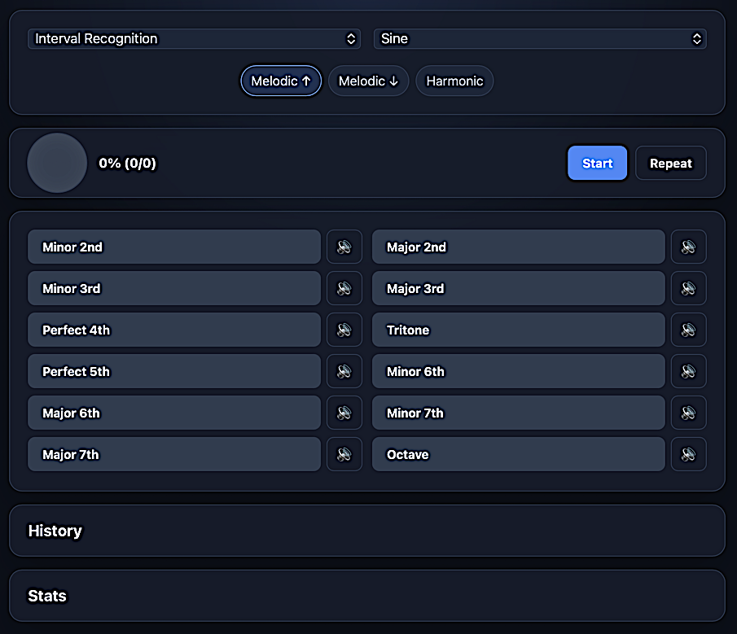

# Ear Trainer

Ear Trainer is a browser-based music ear-training app contained in a single HTML file. It generates tones with the Web Audio API and provides exercises for recognizing intervals, chord qualities, and scales. [Demo](http://barmpalias.net/share/ear)

## Exercises

- **Interval Recognition** — identify intervals from a minor second through an octave. Intervals can be played ascending, descending, or harmonically.
- **Chord Quality** — identify major, minor, diminished, augmented, dominant seventh, major seventh, and minor seventh chords.
- **Scale Recognition** — identify major, natural minor, harmonic minor, pentatonic, and whole-tone scales.

The Sound menu offers several oscillator waveforms and custom timbres. The speaker button beside each answer plays an example without submitting that answer.

## Using the app

1. Open `ear-training.html` in a modern browser.
2. Choose an exercise and sound.
3. For interval exercises, choose a playback direction or harmonic playback.
4. Press **Start** to hear a question.
5. Select an answer, then press **Next** for another question. Use **Repeat** to replay the current question.

The score panel shows the percentage and number of correct answers in the current session. Feedback beside it displays the correct answer after each guess.

## History and statistics

The foldable **History** panel shows recent session scores for the current browser/device.

The foldable **Stats** panel shows accuracy for every individual interval, chord quality, and scale. Attempted items are ordered from the lowest success percentage to the highest; items that have not been played display `-`.

History and statistics are stored locally in the browser with `localStorage`. Nothing is sent to a server. Selecting **Clear History** removes both the session history and accumulated statistics.

